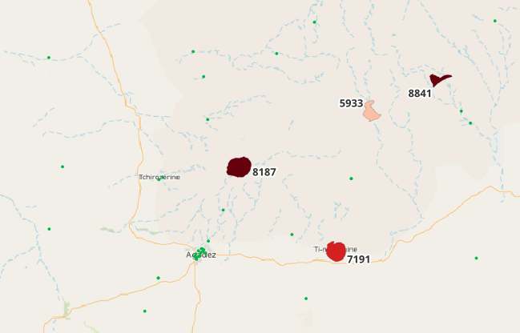
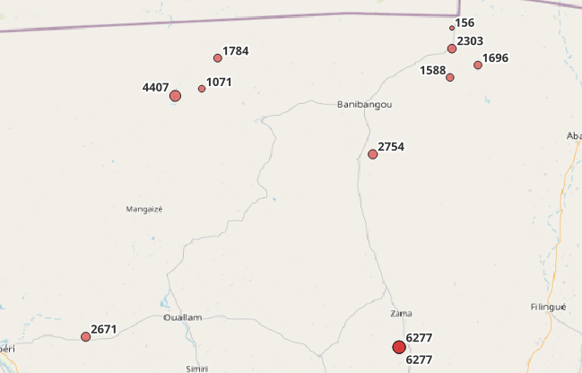

# Extension de la couverture sanitaire au Niger

Le module d'extension de la couverture sanitaire au Niger permet le calcul automatique d'un ensemble de métriques et d'analyses. L'objectif est triple:

* Identifier les zones du territoires candidates à l'implantation d'un CSI
* Identifier les conversions possibles des cases de santé vers un CSI
* Identifier les CSI surchargés

## Données d'entrée

Le module repose sur quatre sources de données:

### Population

Les données de distribution de la **population** sont requises afin d'estimer les statistiques de couverture sanitaire. Les données de population peuvent être fournies par l'utilisateur selon deux formats :

* Raster (fichier `*.tif`)
* Tabulaire (fichier `*.csv`, `*.xls` ou `*.xlsx`)

Si l'utilisateur fournit les données sous la forme tabulaire, alors les noms des colonnes avec les informations de localisation (latitude, longitude) et de dénombrement (population) doivent aussi être spécifiés.
Si aucune donnée n'est renseignée par l'utilisateur, le programme télécharge les données Worldpop pour l'année 2020 (voir [worldpop.org](https://www.worldpop.org/geodata/listing?id=79) pour plus d'information).

### Districts

Les districts sont l'unité d'aggregation principale du module d'analyse : l'ensemble des statistiques sont calculées de manière indépendente et isolée pour chaque district.

Le fichier de district (GeoPackage, Shapefile ou GeoJSON) peut être fourni par l'utilisateur.

Il peut aussi être téléchargé automatiquement depuis une instance DHIS2 si les crédentiels sont fournis par l'utilisateur. Dans ce cas, l'utilisateur doit aussi spécifier le niveau hiérarchique correspondant à l'unité d'organisation.

### Centres de santé

Les centres de santé sont les formations sanitaires correspondant à l'offre actuelle de couverture sanitaire.
C'est pourquoi cette catégorie de formations sanitaires peut inclure les hôpitaux en plus des centres de santé.

Le fichier (GeoPackage, Shapefile ou GeoJSON) peut être fourni par l'utilisateur ou téléchargé automatiquement depuis une instance DHIS2 si les crédentiels sont fournis par l'utilisateur.
Dans ce cas, l'utilisateur doit aussi spécifier le niveau hiérarchique correspondant à l'unité d'organisation concernée ainsi que les groupes DHIS2 à inclure et/ou à exclure.

### Cases de santé

Les cases de santé sont les formations sanitaires candidates à une conversion en CSI.

Le fichier (GeoPackage, Shapefile ou GeoJSON) peut être fourni par l'utilisateur ou téléchargé automatiquement depuis une instance DHIS2 si les crédentiels sont fournis par l'utilisateur.
Dans ce cas, l'utilisateur doit aussi spécifier le niveau hiérarchique correspondant à l'unité d'organisation concernée ainsi que les groupes DHIS2 à inclure et/ou à exclure.

## Données de sortie

Le module calcule l'ensemble des métriques de manière indépendante pour chaque district: la population de l'autre côté d'une frontière d'un district n'est pas prise en compte lors du calcul de la population desservie par un CS.

  
*Image: Zones d'extension potentielles et population desservie*

Les zones d'extension potentielles sont des espaces caractérisés par une importante population mais une absence de CSI, i.e. une population desservie supérieure à `MIN_POPULATION_SERVED` (5,000 par défaut) et à plus de `MIN_DISTANCE_FROM_CSI` (15 km par défaut) d'un CSI existant.

  
*Image: Conversions possibles de cases de santé et population desservie*

Les cases de santé à conversion potentielle sont identifiées par une forte population desservie (5,000 par défaut) et une localisation à plus de `MIN_DISTANCE_FROM_CSI` (15 km par défaut) d'un CSI.

## Paramètres

### Général

* Dossier de sortie : dossier où enregistrer les résultats
* Pays (optionnel) : ISO-A3 code du pays (défaut = NER)
* EPSG (optionnel) : EPSG code du système de coordonnées de référence (défaut = 32632)
* Overwrite (optionnel) : Ecraser les données existantes (défaut = Faux)

### DHIS2

L'ensemble de ces paramètres doit être renseigné pour pouvoir télécharger automatiquement les districts ou les formations sanitaires depuis une instance DHIS2. Il n'est pas nécessaire de remplir ces champs si les fichiers de districts, de centres de santé et de cases de santé sont fournis par l'utilisateur.

* Instance DHIS2 (optionnel) : URL de l'instance DHIS2
* Utilisateur DHIS2 (optionnel) : nom d'utilisateur DHIS2
* Mot de passe DHIS2 (optionnel) : mot de passe DHIS2

### Formations sanitaires

Cette catégorie de paramètres permet à l'utilisateur de fournir les fichiers de districts et de formations sanitaires, ou bien de paramétrer leur import depuis DHIS2. Si l'utilisateur fournit les fichiers, les paramètres relatifs à DHIS2 ne seront pas pris en compte.

Par défaut, le programme importe les formations sanitaires depuis DHIS2 si les crédentiels sont fournis par l'utilisateur.

* Districts (optionnel) : fichier de districts (Shapefile, GeoPackage, GeoJSON), ne pas remplir pour importer depuis DHIS2
* Niveau hiérarchique des districts (optionnel) : niveau hiérarchique de l'unité d'organisation correspondant aux districts dans DHIS2 (default = 3)
* Niveau hiérarchique des FOSAs (optionnel) : niveau hiérarchique de l'unité d'organisation correspondant aux centres et cases de santé dans DHIS2 (default = 5)
* Centres de santé (optionnel) : fichier de centres de santé (Shapefile, GeoPackage, GeoJSON), ne pas remplir pour importer depuis DHIS2
* Centres de santé (groupes DHIS2) (optionnel) : identifiants des groupes DHIS2 à extraire, séparés par des espaces. Pour exclure un groupe, préfixer l'identifiant du groupe par le signe `-`.
* Cases de santé (optionnel) : fichier de cases de santé (Shapefile, GeoPackage, GeoJSON), ne pas remplir pour importer depuis DHIS2
* Cases de santé (groupes DHIS2) (optionnel) : identifiants des groupes DHIS2 à extraire, séparés par des espaces. Pour exclure un groupe, préfixer l'identifiant du groupe par le signe `-`.
* Garder une copie des FOSAs (optionnel) : sauvegarde les districts et FOSAs importés depuis DHIS2 dans le dossier de sortie.

### Population

Cette catégorie permet de gérer l'import ou le téléchargement des données de population. Si l'utilisateur ne fournit aucun paramètre, alors les données Worldpop 2020 sont utilisées.

* Données de population (optionnel) : fichier de population (GeoTIFF ou table CSV/Excel)
* Latitude (optionnel) : nom de la colonne avec la valeur de latitude (si CSV/Excel seulement)
* Longitude (optionnel) : nom de la colonne avec la valeur de longitude (si CSV/Excel seulement)
* Dénombrement (optionnel) : nom de la colonne avec la valeur de dénombrement (si CSV/Excel seulement)

### Worldpop

Ces paramètres ne sont pris en compte par le programme que si les données Worldpop sont automatiquement téléchargées.

* UN ajustement (optionnel) : cette option permet de télécharger la version des données sans ajustement de la population (téléchargement des données ajustées par défaut)
* Non-contraint (optionnel) : cette option permet de télécharger la version non-contraintes par le bâti des données de population (téléchargement des données contraintes par défaut)

### Modélisation

* Distance minimum : la distance minimum requise à n'importe quel CSI existant pour qu'une zone ou case de santé puisse être considérée pour une extension (en mètres) (defaut = 15 000 m)
* Distance desservie : le rayon autour duquel la population est considérée comme desservie (en mètres) (defaut = 5 000 m)
* Population desservie minimum : population desservie minimum pour qu'une zone ou case de santé soit considérée pour une extension (defaut = 5 000)

## Installation (utilisateur)

1. Télécharger l'archive `healthcoverage.zip` depuis Github ([ici](https://github.com/BLSQ/health-coverage-extension/releases))
2. Extraire l'archive
3. Lancer l'executable `healthcoverage\healthcoverage.exe` pour démarrer l'interface graphique ;
4. (Optionnel) Créer un raccourci vers `healthcoverage\healthcoverage.exe`

En cas de mise à jour, supprimer ou remplacer le contenu du dossier `healthcoverage`.

## Installation (developpeur)

Cloner le dépôt Github et installer les dépendences Python :

``` bash
git clone https://github.com/BLSQ/health-coverage-extension
cd health-coverage-extension
pip install -r requirements.txt
```

NB: GDAL doit également être installé.

## Packager l'interface graphique

```
cd health-coverage-extension

rm -r dist/healthcoverage
rm -r build

pyinstaller \
  --onedir \
  --collect-all geopandas \
  --collect-all rasterio \
  --collect-all fiona \
  --collect-all gooey \
  --noconfirm \
  .\healthcoverage.py
```

## Fichiers de sortie

* Résultats de l'analyse :
    * `potential_areas.gpkg`  
    Zones d'extension potentielles (géométries, population desservie, distance au CSI le plus proche).
    * `potential_cs.gpkg`  
    CS à conversion potentielle (géométries, population desservie, distance au CSI le plus proche).
* Données brutes :
    * `csi_population.gpkg`  
    Fichier CSI original avec population desservie.
    * `cs_population.gpkg`  
    Fichier CS original avec population desservie.
    * `priority_areas.gpkg`  
    Raster avec population desservie pour chaque pixel de 100 m.
